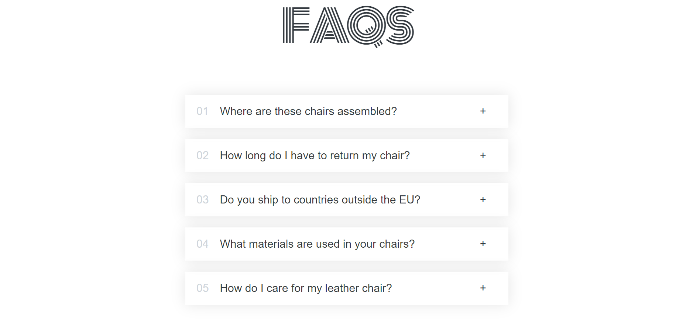

# React + Vite

# FAQ Accordion Component

A responsive FAQ accordion component built with React. Users can click to expand/collapse answers to frequently asked questions about furniture products.



## Features

- 🎯 Interactive accordion functionality
- 💫 Smooth expand/collapse animations
- 🎨 Clean and modern design
- 📱 Fully responsive layout


## Technologies Used

- React 18
- Vite
- CSS3

## Installation

1. Clone the repository:
```bash
git clone https://github.com/AbdelaliAAZZ/Flash-cards.git 
```
2. Navigate to project directory:
```bash
cd flash-cards
```
3. Install dependencies:
 ```bash
npm install
``` 
4. Start the development server:
```bash
npm run dev
```   
